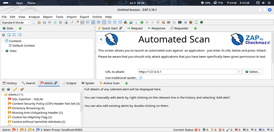
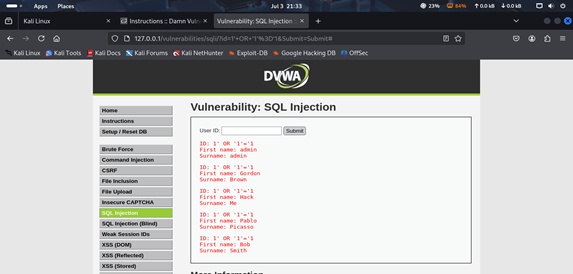
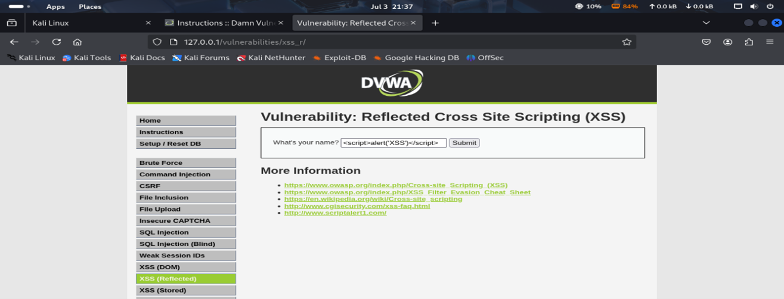
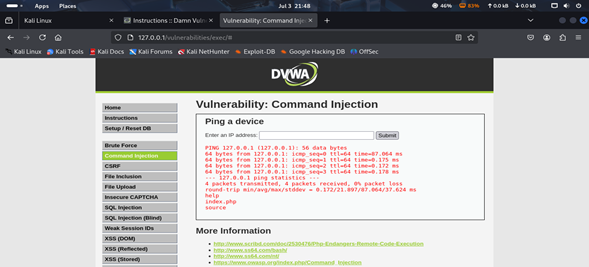

# DVWA Vulnerability Scan and Remediation Report

---

## 🔎 Introduction
The **Damn Vulnerable Web Application (DVWA)** is a deliberately insecure web app for practicing common vulnerabilities.  
This project involved scanning DVWA with **OWASP ZAP**, performing **manual exploitation**, and recommending **remediation strategies**.

---

## 🎯 Objectives
- Access a DVWA instance in a safe environment.  
- Run automated scans with OWASP ZAP.  
- Conduct manual testing of key vulnerabilities.  
- Document vulnerabilities and their impact.  
- Recommend secure coding and configuration practices.  

---

## 🛠️ Methodology

### Step 1: Access DVWA
- DVWA was accessed in a secure hosted lab.  
- Security level set to **Low** for testing purposes.  

### Step 2: Vulnerability Scanning with OWASP ZAP
- Performed passive & active scans.  
- Key findings:  
  - SQL Injection  
  - Cross-Site Scripting (XSS)  
  - Command Injection  
  - Security Misconfiguration  

📸 OWASP ZAP scan results →   

---

### Step 3: Manual Testing

- **SQL Injection**  
  - Payload: `' OR 1=1--`  
  - Result: Login bypass → unauthorized DB access  
  - 📸   

- **Cross-Site Scripting (XSS)**  
  - Payload: ``  
  - Result: JavaScript executed in browser  
  - 📸   

- **Command Injection**  
  - Payload: `127.0.0.1; ls`  
  - Result: Server directory listing returned  
  - 📸   

- **Security Misconfiguration**  
  - Observed: default credentials, verbose errors, exposed admin pages  
  - 📸   

---

## ⚠️ Vulnerability Table

| Vulnerability        | Severity | Description                        | Affected Component |
|-----------------------|----------|------------------------------------|--------------------|
| SQL Injection        | High     | DB access via injection            | Login Page         |
| Cross-Site Scripting | Medium   | Malicious script execution         | Comment Field      |
| Command Injection    | High     | OS command execution               | Ping Utility       |
| Misconfiguration     | Medium   | Default creds, exposed errors      | Admin Panel, Errors |

---

## 🛡️ Remediation Strategies
- **SQL Injection:** Use parameterized queries, strict input validation.  
- **XSS:** Sanitize & encode user input.  
- **Command Injection:** Whitelist inputs, avoid system calls from user input.  
- **Misconfiguration:** Change defaults, restrict admin panels, disable verbose errors.  

---

## 📚 Lessons Learned
- Combining **automated & manual testing** = best coverage.  
- **Input validation** is critical to security.  
- **Configuration hardening** prevents easy exploits.  
- Labs like DVWA provide safe hands-on experience.  

---

## ✅ Conclusion
The DVWA assessment highlighted classic web vulnerabilities. By combining automated scanning with manual testing, critical flaws were uncovered and mapped to clear remediation strategies, strengthening secure coding practices.
