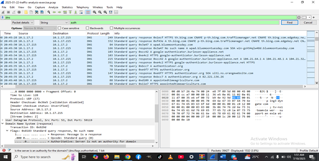
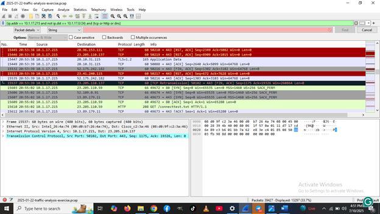
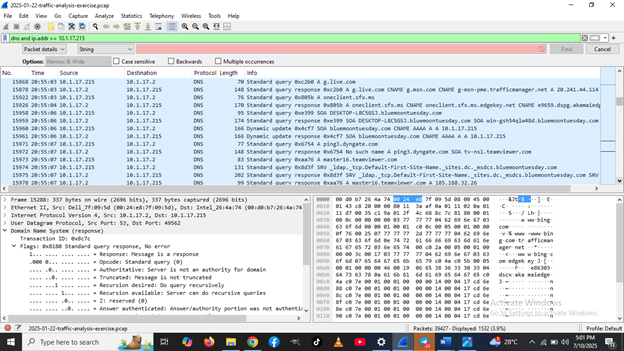
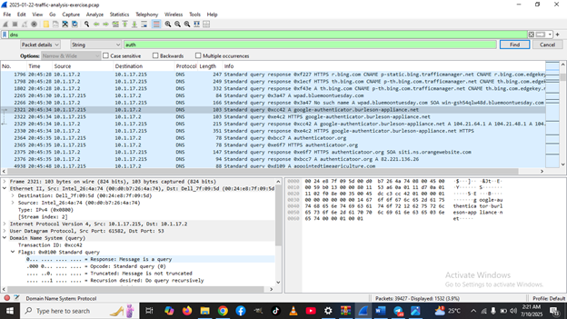

# Incident Report: Wireshark Traffic Analysis – Malicious Download from Fake Software Website

## Executive Summary
On July 9, 2025, at approximately 2:14 PM, an employee of Bluemoon Tuesday Inc. reported unusual system behavior after attempting to download a Windows version of Google Authenticator. The download originated from a suspicious website. Following execution of a `.zip` file, the system showed performance issues, CMD popups, and Outlook access failures. This report investigates the PCAP file to identify malware activity, Indicators of Compromise (IOCs), and prevention recommendations.

---

## Timeline of Events
- **20:45:34** – User accessed fake domain `google-authenticator.burleson-appliance.net`  
- **20:53:35** – ZIP file downloaded from fake site  
- **20:53:35** – Outbound TCP traffic to `23.205.110.137` (likely C2 server)

---

## Analysis Walkthrough
Wireshark revealed DNS/HTTP traffic to the fake domain. Eight minutes later, a TCP connection attempt to IP `23.205.110.137` was seen, consistent with malware callback behavior.

### Screenshots
  
  
  
  

---

## Host and User Details
- **IP Address:** 10.1.17.215  
- **Hostname:** DESKTOP-L8C5GSJ  
- **MAC Address:** Intel_26:4a:74 (00:d0:b7:26:4a:74)  
- **Domain:** bluemoontuesday.com  
- **Username:** [NOT FOUND – Encrypted via Kerberos]  

---

## Indicators of Compromise (IOC)

| IOC Type   | Value                                     | Notes                       |
|------------|-------------------------------------------|-----------------------------|
| Domain     | google-authenticator.burleson-appliance.net | Fake Authenticator site |
| IP Address | 23.205.110.137                            | C2 server                   |
| Hostname   | DESKTOP-L8C5GSJ                           | Infected client             |
| MAC Addr   | Intel_26:4a:74 (00:d0:b7:26:4a:74)        | Infected client             |
| URL        | http://google-authenticator.burleson-appliance.net | Initial infection vector |

---

## Evidence
- [Filtered PCAP File](https://drive.google.com/file/d/1PZFh6dEwq-hVqeXN_Nk7t4AMgWiKQuMF/view?usp=sharing)

---

## Recommendations
- Block access to known malicious domains/IPs at the firewall  
- Run full AV and EDR scans on the infected host  
- Isolate device (10.1.17.215) until clean  
- Apply DNS filtering against suspicious domains  
- Conduct regular staff security awareness training  
- Enable application whitelisting to block unknown ZIP/EXE execution  
- Monitor for beaconing or repeated attempts to unknown IPs  
- Review domain controller logs for unusual activity  
- Enable detailed SMB and Kerberos packet logging  
- Keep endpoints patched and hardened  
