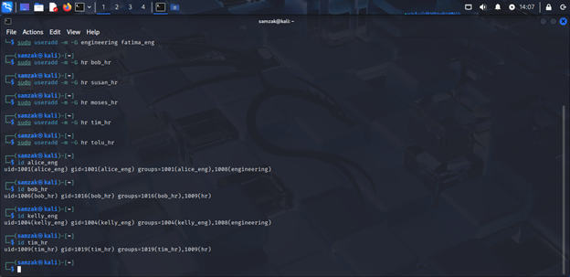
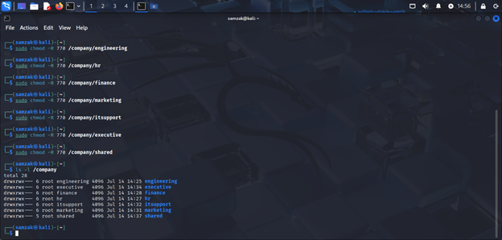
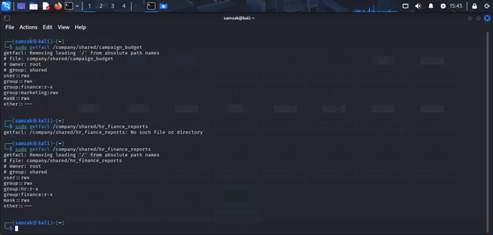

# CYBERSHIELD CORP – RBAC Implementation Report

## 📌 Project Overview
Cyber Shield Corp, a global cybersecurity firm with HQ in Nairobi and branches in Lagos, London, and Kuala Lumpur, initiated a complete overhaul of its access control systems.  
This project focused on **Role-Based Access Control (RBAC)** implementation on a fresh Kali Linux installation.

**Objective:** Enforce the **principle of least privilege** by designing department-specific directory structures, creating groups, assigning users, configuring permissions, and implementing secure shared access.

---

## 🏢 Departments
- **Engineering** – development, automation, deployment  
- **HR** – employee records, payroll  
- **Finance** – budgets, billing, taxation  
- **Marketing** – branding, content, analytics  
- **IT Support** – administration, helpdesk, backup  
- **Executive** – top management  

---

## 👥 User Roles
- **Juniors & Interns** → Limited access (read / read-execute)  
- **Mid-level & Seniors** → Full access to department directory  
- **Executives** → Full access to executive folder  
- **Shared directories** → Controlled using **ACLs**  

---

## 📂 Directory Structure
All directories created under `/Company`:

---

## 🔐 Group & Permission Strategy
- Groups created per department.  
- Folder ownership: `root:<department_group>`  
- Permissions: `chmod 770`  
- Shared access controlled with **ACLs** (`setfacl`)  
- Default ACL masks fixed to prevent `#effective:---` errors  

---

## 📑 Shared Folder Access (ACLs)
- `/Company/shared/campaign_budget`  
  - Marketing: `rwx`  
  - Finance: `rx`  
- `/Company/shared/hr_finance_reports`  
  - HR: `rx`  
  - Finance: `rx`  
- `/Company/shared/announcements` → All users `r--`  

---

## 👨‍💻 Example Users
| Name      | Username    | Dept       | Role         | Access  |
|-----------|-------------|------------|--------------|---------|
| Alice U.  | alice_eng   | Engineering| Junior Dev   | Full    |
| Kelly T.  | kelly_eng   | Engineering| Intern       | Limited |
| Bob K.    | bob_hr      | HR         | HR Assistant | Full    |
| Tim I.    | tim_hr      | HR         | Intern       | Limited |
| John C.   | john_fin    | Finance    | Accountant   | Full    |
| Clara N.  | clara_fin   | Finance    | Analyst      | Full    |
| Rita M.   | rita_mark   | Marketing  | Analyst      | Full    |
| Kevin O.  | kevin_it    | IT Support | Intern       | Limited |
| Jane A.   | ceo_exec    | Executive  | CEO          | Full    |

---

## 📸 Screenshots
- User creation & group assignment →   
- Directory ownership & permissions →   
- ACL setup & verification →   

---

## 🛡️ Best Practices
- Enforce **least privilege**  
- Keep `shared` group empty  
- Use `getfacl` & `id` for verification  
- Root owns all directories for control  
- Perform regular audits  

---

## 📝 Observations & Lessons Learned
- Misconfigured ACL masks cause access issues (`#effective` field useful)  
- Planning structure in advance prevents rework  
- Combining Unix permissions with ACLs = better flexibility & security  

---

## ⚙️ Bash Script for Reimplementation
See [script.sh](script.sh) for full setup automation.  

---

## ✅ Recommendation
- Document all access structures for handover  
- Review access regularly  
- Use ACLs for interdepartmental collaboration securely  
