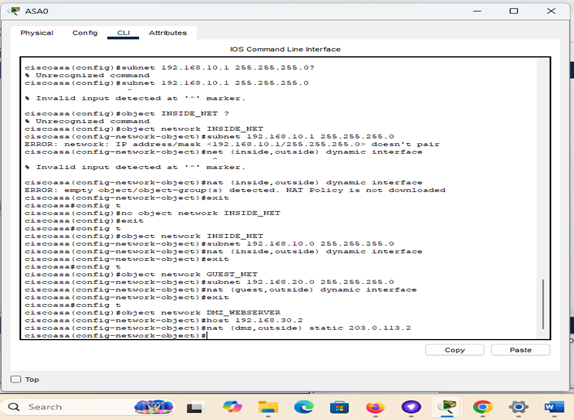

# Secure Network Topology Design

## Objective
To design and configure a secure office network topology with VLANs, a Cisco ASA firewall, NAT, ACLs, and Wi-Fi access points.  
The goal is to ensure network segmentation, secure Internet access, and isolation of guest users from the office LAN.

---

## Steps

### Step 1: Network Planning
- Divided the network into three segments:
  - **Office LAN (192.168.10.0/24)**
  - **Guest Wi-Fi (192.168.20.0/24)**
  - **DMZ (192.168.30.0/24)**
- Assigned security levels (Inside = 100, Guest = 50, DMZ = 25, Outside = 0).

---

### Step 2: VLAN Configuration
- Configured VLANs on switches for each segment.
- Assigned interfaces to their VLANs.
- Verified device connectivity within each VLAN.

**Screenshot: VLAN Configuration**  

---

### Step 3: Firewall Setup (Cisco ASA)
- Configured interfaces (inside, guest, dmz, outside).
- Applied ACLs:
  - Guest network blocked from accessing Office LAN.
  - Guest network allowed Internet access.
  - Outside access restricted to DMZ web server (ports 80/443 only).
- Configured NAT for inside and guest networks.

**Screenshot: Firewall ACL Rules**  

**Screenshot: NAT Configuration**  

---

### Step 4: Wi-Fi Access Point Configuration
- Created two SSIDs:
  - **Office_WiFi → VLAN 10**
  - **Guest_WiFi → VLAN 20**
- Enabled WPA2 encryption with strong passwords.
- Disabled WPS for security.
- Verified Guest Wi-Fi cannot reach Office LAN.

**Screenshot: Wi-Fi Test Result**  

---

## Configuration Files
- [`secure_topology_config.txt`](./secure_topology_config.txt) → ASA firewall and VLAN configuration.
- [`wifi_config.txt`](./wifi_config.txt) → Access Point setup.

---

## Results
- ✅ Guest Wi-Fi isolated from Office LAN.  
- ✅ DMZ server accessible from Internet on ports 80/443 only.  
- ✅ Office LAN retained full access.  

---
